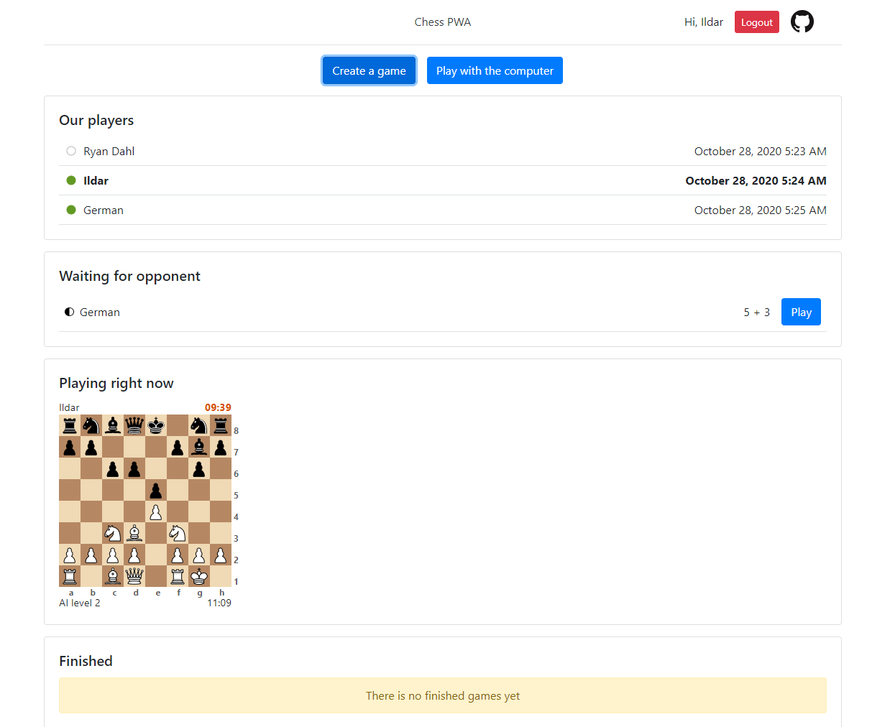
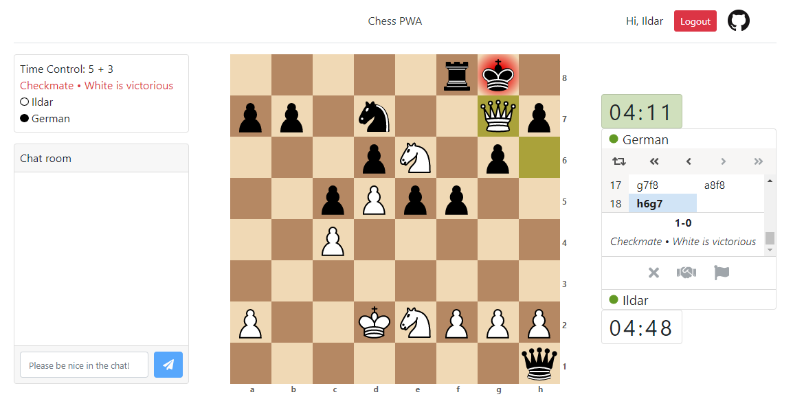

<h1 align="center">Chess PWA</h1>

A small [React](https://reactjs.org/) application where users can play chess. [Live Demo](https://ildar-icoosoft.github.io/chess-pwa/)

    
     
    
    

    

    

[Chess backend](https://github.com/ildar-icoosoft/chess-backend) is written in Node.js and relies on [Sails](https://sailsjs.com/) framework.

The application is very small, I made it for demonstration purposes. It contains only 2 pages, but a lot of functionality.

